# Time Series Forecasting Model Comparison

[](https://python.org)
[](https://pytorch.org)
[](https://unit8co.github.io/darts/)
[](https://github.com/zhouhaoyi/ETDataset)
[](https://time-series-forecasting-comparison-q74ppg2ggcaqxywkqwqxsw.streamlit.app/)

## Why This Project

Practitioners choosing a forecasting model face a confusing landscape: statistical methods are fast and interpretable, ML models handle non-linearity well, and deep learning models promise the highest accuracy — but come with steep compute costs. This project runs all three families side-by-side on the same dataset under the same evaluation protocol, so the accuracy/complexity trade-offs are visible and reproducible.

## System Architecture

```mermaid
flowchart LR
    A[("ETT Dataset\ndata/raw/ETT/\nETTh1/h2/m1/m2\n17,420–69,680 rows")] --> B

    subgraph B ["Data Loading (src/data/ett_loader.py)"]
        B1["ETTLoader.load()\nparse_dates, sort"] --> B2["get_splits()\n70/10/20 chronological"]
        B2 --> B3["Feature Engineering\ntime sin/cos + lags\n+ rolling stats"]
    end

    B3 --> C

    subgraph C ["Training (scripts/train_model.py)"]
        C1["--mode univariate\n(OT history only)"]
        C2["--mode multivariate\n(+ HUFL/HULL/MUFL\n/MULL/LUFL/LULL)"]
        C3["--tune\nOptuna HPO\n8–50 trials"]
    end

    C --> D["src/models/\nstatistical.py · ml.py · deep_learning.py"]
    D --> E["src/evaluation/metrics.py\nRMSE MAE MAPE SMAPE R² MASE MDA Bias"]
    E --> F["data/forecasts/ETT/*.json\n(pre-computed — committed)"]
    F --> G["Streamlit Dashboard\nsrc/ui/dashboard.py\nBenchmark · Gallery · Inspector · Explorer · Ask AI"]
    G --> H["OpenAI GPT-4o mini\nRAG retrieval + AI Explainability"]
```



## Models and Algorithms

### Statistical Family

These models work directly on the time series values. They are fast to fit, require no feature engineering, and are fully interpretable, but have limited capacity for complex non-linear patterns.

#### Holt-Winters (Exponential Smoothing)

Decomposes a series into level, trend, and seasonality components and updates each with exponential smoothing.

```
Level:      l_t = α(y_t − s_{t−m}) + (1−α)(l_{t−1} + b_{t−1})
Trend:      b_t = β(l_t − l_{t−1}) + (1−β) b_{t−1}
Seasonality: s_t = γ(y_t − l_{t−1} − b_{t−1}) + (1−γ) s_{t−m}
Forecast:   ŷ_{t+h} = l_t + h·b_t + s_{t+h−m(k+1)}
```

Where α ∈ [0,1] controls level smoothing, β trend smoothing, γ seasonality smoothing, m = seasonal period, k = ⌊(h−1)/m⌋.

#### ARIMA (AutoRegressive Integrated Moving Average)

Combines autoregression (AR), differencing (I) for stationarity, and a moving-average error model (MA). Order (p,d,q) is selected automatically by `auto_arima` with ADF stationarity test.

```
φ(B) ∇^d y_t = θ(B) ε_t

AR polynomial:  φ(B) = 1 − φ₁B − φ₂B² − ⋯ − φ_pB^p
MA polynomial:  θ(B) = 1 + θ₁B + θ₂B² + ⋯ + θ_qB^q
Differencing:   ∇^d = (1−B)^d   (d=1 removes linear trend)
```

Where B is the backshift operator (By_t = y_{t−1}) and ε_t ~ N(0, σ²).

#### Prophet (Facebook)

Additive decomposition with automatic changepoint detection for piecewise linear/logistic trend and Fourier-series seasonality. Handles holidays and missing data natively.

```
y(t) = g(t) + s(t) + h(t) + ε_t

Trend:      g(t) = k + (a(t)ᵀδ)t + (m + a(t)ᵀγ)   [piecewise linear]
Seasonality: s(t) = Σ_{n=1}^{N} (a_n cos(2πnt/P) + b_n sin(2πnt/P))   [Fourier]
Holidays:   h(t) = Z(t)κ   [indicator × effect]
```

Where P = period, N = Fourier order, δ = changepoint slopes, a(t) = indicator vector.

---

### Machine Learning Family

These models treat forecasting as supervised regression on tabular lag features. They benefit from exogenous covariates (multivariate mode) and handle non-linear relationships without explicit model specification.

#### Random Forest

Bootstrap-aggregated ensemble of regression trees. Each tree is trained on a bootstrap sample and a random subset of features; averaging B trees reduces variance.

```
ŷ(x) = (1/B) Σ_{b=1}^{B} f_b(x)

Var(ŷ) = σ²/B + (1 − 1/B) ρ σ²

where ρ = pairwise tree correlation (reduced by feature subsampling)
```

Higher B and lower ρ (more feature randomness) → lower prediction variance.

#### XGBoost (eXtreme Gradient Boosting)

Additive ensemble of regression trees fitted sequentially by minimising a regularised second-order Taylor approximation of the loss.

```
F_K(x) = Σ_{k=1}^{K} η f_k(x)

Objective: L^(K) = Σ_i [g_i f_K(x_i) + (1/2) h_i f_K(x_i)²] + Ω(f_K)

Regulariser: Ω(f) = γT + (λ/2)||w||²

g_i = ∂l(y_i, ŷ_i^(K−1))/∂ŷ   (first-order gradient)
h_i = ∂²l(y_i, ŷ_i^(K−1))/∂ŷ²  (second-order hessian)
```

Where T = number of leaves, w = leaf weights, η = learning rate, γ/λ = regularisation.

#### LightGBM (Light Gradient Boosting Machine)

Same gradient boosting objective as XGBoost, but uses **histogram-based** binning for split finding and **leaf-wise** (best-first) tree growth. Also uses GOSS and EFB for scalability.

```
Same objective as XGBoost; key differences:

Histogram split: bin features → O(#bins) vs O(n log n) exact
Leaf-wise growth: expand leaf with max loss reduction (not level-wise)
GOSS: keep large-gradient instances + random sample small-gradient ones
EFB: bundle mutually exclusive sparse features into single feature
```

Uses well-regularized fixed defaults: `reg_alpha=0.1, reg_lambda=0.1, n_estimators=500`.

#### CatBoost

Gradient boosting with **ordered boosting** (prevents target leakage) and **oblivious trees** (symmetric structure for fast inference). Natively handles categorical features via target statistics.

```
Same gradient boosting objective.

Ordered boosting: for sample i, use only a permutation-prior subset σ_r(x_i)
                  to compute target statistics — prevents overfitting on training data

Oblivious tree: all nodes at depth d use the same split (feature, threshold)
               → O(2^depth) lookup table for inference
```

---

### Deep Learning Family

These models learn sequence representations directly from raw time series without manual feature engineering. They excel at long-range dependencies but require significantly more training time.

#### LSTM (Long Short-Term Memory)

Extends the vanilla RNN with gating mechanisms that learn to selectively retain or forget information over long sequences, mitigating the vanishing gradient problem.

```
Forget gate:  f_t = σ(W_f · [h_{t−1}, x_t] + b_f)
Input gate:   i_t = σ(W_i · [h_{t−1}, x_t] + b_i)
Candidate:    c̃_t = tanh(W_c · [h_{t−1}, x_t] + b_c)
Cell state:   c_t = f_t ⊙ c_{t−1} + i_t ⊙ c̃_t
Output gate:  o_t = σ(W_o · [h_{t−1}, x_t] + b_o)
Hidden state: h_t = o_t ⊙ tanh(c_t)
```

Implementation: `_LSTMNet(nn.Module)` with direct multi-step head `Linear(hidden, horizon)`. Evaluated with rolling-window oracle strategy (ground-truth context refreshed every `horizon` steps).

#### Transformer (Attention-based)

Replaces recurrence with scaled dot-product self-attention, enabling parallel computation over the entire input sequence and capturing global dependencies without distance bias.

```
Attention:      Attn(Q, K, V) = softmax(QKᵀ / √d_k) V
Multi-head:     MH(Q, K, V) = Concat(head₁, …, head_h) Wᴼ
                where head_i = Attn(Q W_i^Q, K W_i^K, V W_i^V)
FFN:            FFN(x) = max(0, xW₁ + b₁) W₂ + b₂
```

Each layer: `LayerNorm(x + Attn(x)) → LayerNorm(x + FFN(x))`. Implemented via Darts `TransformerModel`.

#### N-BEATS (Neural Basis Expansion Analysis for Interpretable Time Series Forecasting)

A pure MLP-based architecture organised as a stack of blocks, each producing a **backcast** (residual explanation) and **forecast** (contribution to final output). No recurrence, no convolution.

```
Block l output:
  θ_b^l, θ_f^l = FC(residual input x_l)
  backcast:  b_l = Σ_k θ_b^l · g_k^b    (basis expansion)
  forecast:  f_l = Σ_k θ_f^l · g_k^f

Stack: x_{l+1} = x_l − b_l
Final: ŷ = Σ_{l=1}^{L} f_l
```

With generic (data-driven) basis functions, or interpretable (trend/seasonality) bases via `GENERIC` and `SEASONALITY` stacks.

#### TFT (Temporal Fusion Transformer)

A multi-horizon architecture combining variable selection networks (VSN), gated residual networks (GRN), and multi-head self-attention. Produces interpretable attention weights over past time steps.

```
Variable Selection:  VSN → weighted feature embeddings per time step
Sequence encoding:   LSTM encoder over past obs → context vector c_s, c_e, c_h, c_c
Enrichment:          GRN(past) with c_e as context
Attention:           InterpretableMultiHead(Q=enriched, K=V=encoder output)
Output:              GLU → Add+Norm → Dense → quantile outputs
```

Where GLU = Gated Linear Unit: `GLU(a,b) = a ⊙ σ(b)`. Implemented via Darts `TFTModel` with `add_relative_index=True`.

---

## Benchmark Results — ETTh1 (Horizon = 24)

> **ML models**: multivariate mode (15 features: 6 load cols + 6 time sin/cos + 3 OT lags) + oracle lag filling + Optuna HPO.  
> **DL models**: univariate mode (TFT also gets 6 load cols as past_covariates), 100 max epochs + early stopping (patience=15).  
> **Remediation applied**: RF max_features Optuna, XGBoost early stopping + reg α/λ, all DL with larger capacity and 168-step input window.  
> See [docs/adr/ADR-005](docs/adr/ADR-005-feature-engineering.md) for the oracle lag rationale.

| Model | Family | RMSE ↓ | MAE ↓ | SMAPE (%) ↓ | R² ↑ | Train RMSE | Gap | Fix Applied |
|-------|--------|--------|-------|-------------|------|------------|-----|-------------|
| **RF (tuned)** | ML | **0.703** | **0.503** | **10.25** | **0.958** | 0.744 | 0.95× ✅ | max_features Optuna |
| CatBoost | ML | 0.744 | 0.531 | 11.11 | 0.953 | 0.910 | 0.82× † | none needed |
| LightGBM | ML | 0.755 | 0.556 | 11.25 | 0.952 | 0.687 | 1.10× ✅ | none needed |
| XGBoost (tuned) | ML | 0.756 | 0.552 | 11.22 | 0.952 | 0.751 | 1.01× ✅ | early stop + reg α/λ Optuna |
| Transformer (v2) | Deep | 3.525 | 2.900 | 41.13 | −0.046 | — | — | d_model 64→128, chunk 96→168 |
| Prophet | Statistical | 4.030 | 3.244 | 47.76 | −0.368 | — | — | — |
| TFT (v2) | Deep | 4.214 | 3.413 | 47.37 | −0.495 | — | — | hidden 64→128, chunk 96→168, past_covariates |
| N-BEATS (v2) | Deep | 4.358 | 3.483 | 44.64 | −0.599 | — | — | chunk 96→168 |
| LSTM ‡ | Deep | 5.332 | 4.457 | 49.89 | −1.394 | 7.266 | 0.73× | v1 kept (v2 MPS OOM) |
| Holt-Winters | Statistical | 7.851 | 6.614 | 125.41 | −4.190 | — | — | — |
| ARIMA | Statistical | 8.774 | 8.171 | 75.34 | −5.483 | — | — | — |

> † CatBoost train RMSE > test RMSE: ordered boosting uses held-out subsets — conservative in-sample by design.  
> ✅ Gap < 1.2× = well-fitted. ⚠️ Gap > 2.0× = overfitting. Gap < 1.0× = expected ordered-boosting effect.  
> ‡ LSTM v2 (hidden=256, layers=3, input_len=168) caused MPS kernel hang on Apple Silicon; v1 result retained.

**Key findings:**
- **ML dominates** because oracle lag features (OT_lag_1/2/24) make 24-step forecasting near 1-step-ahead. RF tuned to RMSE=0.703, the best overall result.
- **Overfitting remediation worked**: RF gap closed from 2.13×→0.95× (RMSE 0.783→0.703); XGBoost gap from 1.23×→1.01× (RMSE 0.847→0.756). Both now well-fitted.
- **CatBoost's ordered boosting** produces conservative in-sample predictions: test RMSE (0.744) < train RMSE (0.910). This is by design.
- **DL v2 capacity increase** (LSTM hidden 128→256 + layers 2→3; Transformer d_model 64→128; all DL chunk 96→168) did not yield major gains — DL models remain constrained by univariate input vs ML oracle lags.
- **Statistical models underperform** forecasting 3,484 steps in one shot — autoregressive error compounds; Prophet (4.030) is the statistical exception.

## Feature Engineering

Two modes controlled by `--mode` flag:

### Univariate (default)
Forecast OT from its own history. Features: cyclical time encodings + autoregressive lags.

| Feature | Formula | Purpose |
|---------|---------|---------|
| `hour_sin/cos` | sin/cos(2π·h/24) | Cyclical hour encoding |
| `dow_sin/cos` | sin/cos(2π·d/7) | Day-of-week seasonality |
| `month_sin/cos` | sin/cos(2π·(m−1)/12) | Annual seasonality |
| `OT_lag_1/2/24` | OT shifted 1,2,24 steps | Recent history for ML |
| `OT_rolling_mean_3` | rolling(3).mean().shift(1) | Short-term trend level |
| `OT_rolling_std_3` | rolling(3).std().shift(1) | Local volatility |
| `OT_growth_rate` | pct_change().shift(1) | Relative change |
| `OT_trend_3` | polyfit slope on last 3 points, shift(1) | Instantaneous slope |

### Multivariate (`--mode multivariate`)
Adds all 6 load columns as covariates for ML models. Expands feature matrix from 11 to 17 columns.

## Hyperparameter Tuning (Optuna)

Enabled via `--tune`:

| Model | Trials | Objective | Direction |
|-------|--------|-----------|-----------|
| Holt-Winters | 15 | RMSE on train residuals | Minimize |
| Random Forest | 10 | R² on validation | Maximize |
| CatBoost | 8 | R² on validation | Maximize |
| XGBoost | 50 | R² on validation | Maximize |
| LightGBM | — | Fixed regularized defaults | — |

## Evaluation Metrics

| Metric | Formula | Best | Notes |
|--------|---------|------|-------|
| RMSE | √(mean((y−ŷ)²)) | Lower | Penalises large errors |
| MAE | mean(\|y−ŷ\|) | Lower | Robust to outliers |
| MAPE | mean(\|y−ŷ\|/\|y\|)×100 | Lower | Skips \|y\|<0.1 — ETT OT is unbounded (min≈−4.5°C); MAPE is undefined at zero and inflated near zero. Partial metric; use SMAPE/MAAPE as primary percentage metrics |
| SMAPE | mean(\|y−ŷ\|/((|y|+|ŷ|)/2))×100 | Lower | Symmetric; range [0,200]; handles negative OT gracefully — preferred over MAPE in the benchmark table |
| MASE | MAE / MAE(naive) | <1 beats naive | Scale-free across variants |
| R² | 1−SS_res/SS_tot | Higher | 1.0 = perfect |
| MDA | mean(sign(Δy)==sign(Δŷ))×100 | Higher | Directional accuracy % |
| Bias | mean(ŷ−y) | ~0 | Systematic over/under-forecast |
| MAAPE | mean(arctan(\|y−ŷ\|/(\|y\|+ε)))×100 | Lower | Handles near-zero actuals |

## Architecture Decision Records

See [docs/adr/](docs/adr/README.md) for full decision log.

| ADR | Decision | Status |
|-----|----------|--------|
| [ADR-001](docs/adr/ADR-001-task-framing.md) | Task framing: Univariate first, multivariate Phase 2 | Accepted — Amended (multivariate now live) |
| [ADR-002](docs/adr/ADR-002-preprocessing.md) | Preprocessing: Cyclical encoding + lag + rolling features | Accepted |
| [ADR-003](docs/adr/ADR-003-validation-strategy.md) | Validation: Chronological 70/10/20 split | Accepted |
| [ADR-004](docs/adr/ADR-004-model-selection.md) | Model selection: Compare all 11 + Optuna HPO | Accepted |
| [ADR-005](docs/adr/ADR-005-feature-engineering.md) | Feature engineering: Oracle lag filling for ML models | Accepted |
| [ADR-006](docs/adr/ADR-006-deployment.md) | Deployment: Pre-computed JSON → Streamlit dashboard | Accepted |

## Project Structure

```
time-series-forecasting-comparison/
├── src/
│   ├── data/
│   │   └── ett_loader.py          # ETTLoader — load, split, feature engineering
│   │                              # mode='univariate'|'multivariate', rolling features
│   ├── models/
│   │   ├── statistical.py         # HoltWinters (+ Optuna), ARIMA, Prophet
│   │   ├── ml.py                  # RF, XGBoost, LightGBM, CatBoost (+ Optuna)
│   │   └── deep_learning.py       # LSTM (PyTorch), Transformer/N-BEATS/TFT (Darts)
│   ├── evaluation/
│   │   └── metrics.py             # RMSE, MAE, MAPE, SMAPE, MASE, R², MDA, Bias, MAAPE
│   ├── ui/
│   │   └── dashboard.py           # Streamlit 3-tab dashboard (reads JSON only)
│   └── utils.py                   # setup_logging, load_config, save_results
├── scripts/
│   ├── download_data.py           # Download ETT CSVs from GitHub
│   ├── validate_data.py           # Schema + missing value checks
│   ├── train_model.py             # Train one model (--model, --variant, --mode, --tune)
│   └── run_inference.py           # Load checkpoint, re-run inference, save JSON
├── data/
│   ├── raw/ETT/                   # ETTh1.csv, ETTh2.csv, ETTm1.csv, ETTm2.csv
│   ├── processed/ETT/             # (gitignored)
│   └── forecasts/ETT/             # Per-model JSON results (committed — dashboard source)
├── configs/
│   ├── default_config.yaml        # Split ratios, horizon, lag_steps
│   └── optuna_configs.yaml        # Per-model Optuna search spaces and trial counts
├── docs/
│   ├── PRD.md                     # Full product requirements + data definition
│   ├── ARCHITECTURE.md            # Mermaid diagrams + module descriptions
│   └── adr/                       # Architecture Decision Records (6 ADRs)
├── models/                        # Saved .joblib checkpoints (gitignored)
├── notebooks/
├── tests/
└── pyproject.toml                 # Poetry dependency spec
```

## Setup

**Prerequisites:** Python 3.10+, [Poetry](https://python-poetry.org/)

```bash
git clone https://github.com/sabrinapribadi/time-series-forecasting-comparison.git
cd time-series-forecasting-comparison
poetry install
```

## Data

The ETT dataset is already included at `data/raw/ETT/`. To validate:

```bash
poetry run python scripts/validate_data.py
```

## Training

```bash
# Train a single model (univariate, default)
poetry run python scripts/train_model.py --model xgboost --variant h1

# Multivariate mode — ML models receive all 6 load columns as covariates
poetry run python scripts/train_model.py --model catboost --variant h1 --mode multivariate

# With Optuna HPO
poetry run python scripts/train_model.py --model catboost --variant h1 --tune
poetry run python scripts/train_model.py --model holt_winters --variant h1 --tune

# Train all 11 models
make train-all

# Train ML models in multivariate mode
make train-multivariate

# Train tunable models with Optuna
make train-tuned
```

## Dashboard (v2)

Pre-computed JSON results in `data/forecasts/ETT/` power the dashboard — no model weights or retraining needed:

```bash
PYTHONPATH=. poetry run streamlit run src/ui/dashboard.py
```

Dashboard opens at `http://localhost:8502`.

### Tabs

| Tab | What it shows |
|-----|--------------|
| **Benchmark Results** | KPI cards, metric ranking bar chart, multi-metric radar chart, full metric table |
| **Forecast Gallery** | Test-set overlay of all models on OT, family colour-coded, zoomable |
| **Model Inspector** | Actual vs Predicted, residuals, error histogram, scatter + **Overfitting Diagnostic** (Train vs Test RMSE gap) + Feature Importance + SHAP beeswarm (ML) + **AI Explainability** (Statistical/DL) |
| **Data Explorer** | ETT raw signal (all 7 columns), summary statistics, Pearson correlation heatmap |
| **Statistical Tests** | Stationarity (ADF+KPSS), ACF/PACF, Granger Causality, Diebold-Mariano — each with contextual interpretation cards |
| **Ask AI (RAG)** | GPT-4o mini assistant with keyword-retrieval over benchmark data and model metadata; quick-question buttons auto-send |

### AI Explainability

The **Model Inspector** tab includes an AI Explainability button powered by GPT-4o mini. For any selected model it generates a plain-language diagnosis covering:

- Why the model achieves the RMSE it does (linked to algorithm mechanics)
- What residual statistics reveal about its failure modes (bias, autocorrelation)
- When you would or would not choose this model in production

### Ask AI (RAG)

The **Ask AI** tab uses a keyword-based retrieval system over a pre-built knowledge base of benchmark results, model descriptions, metric formulas, and feature engineering notes. Retrieved chunks are sent to GPT-4o mini as context for grounded, cited answers.

```toml
# .streamlit/secrets.toml (gitignored)
OPENAI_API_KEY = "sk-..."
```

### Streamlit Cloud Deployment

**Live app:** https://time-series-forecasting-comparison-q74ppg2ggcaqxywkqwqxsw.streamlit.app/

Use `requirements-streamlit.txt` (5 lightweight deps, no torch/darts/catboost) and add `OPENAI_API_KEY` in the Streamlit Cloud Secrets panel.

```
Main file: src/ui/dashboard.py
```

## Tech Stack

| Layer | Library / Tool |
|-------|---------------|
| Statistical models | statsmodels, pmdarima, prophet |
| ML models | scikit-learn, xgboost, lightgbm, catboost |
| Deep learning | PyTorch 2.x (LSTM), Darts 0.27 (Transformer, N-BEATS, TFT) |
| HPO | Optuna 3.x |
| Data | NumPy, Pandas |
| Frontend | Streamlit 1.35+, Plotly |
| AI / LLM | OpenAI API (GPT-4o mini) — RAG + explainability |
| Metrics | scikit-learn, NumPy |
| Language | Python 3.10+ |
| Hardware | Apple MPS / CUDA / CPU (auto-detected) |
| Dependency mgmt | Poetry |

## Citation

```bibtex
@inproceedings{zhou2021informer,
  title     = {Informer: Beyond Efficient Transformer for Long Sequence Time-Series Forecasting},
  author    = {Zhou, Haoyi and Zhang, Shanghang and Peng, Jieqi and Zhang, Shuai
               and Li, Jianxin and Xiong, Hui and Zhang, Wancai},
  booktitle = {Proceedings of the AAAI Conference on Artificial Intelligence},
  year      = {2021}
}

@inproceedings{Oreshkin2020nbeats,
  title     = {N-BEATS: Neural basis expansion analysis for interpretable time series forecasting},
  author    = {Oreshkin, Boris N and Carpov, Dmitri and Chapados, Nicolas and Bengio, Yoshua},
  booktitle = {International Conference on Learning Representations},
  year      = {2020}
}

@inproceedings{lim2021temporal,
  title     = {Temporal Fusion Transformers for interpretable multi-horizon time series forecasting},
  author    = {Lim, Bryan and Arik, Sercan O and Loeff, Nicolas and Pfister, Tomas},
  journal   = {International Journal of Forecasting},
  year      = {2021}
}
```
