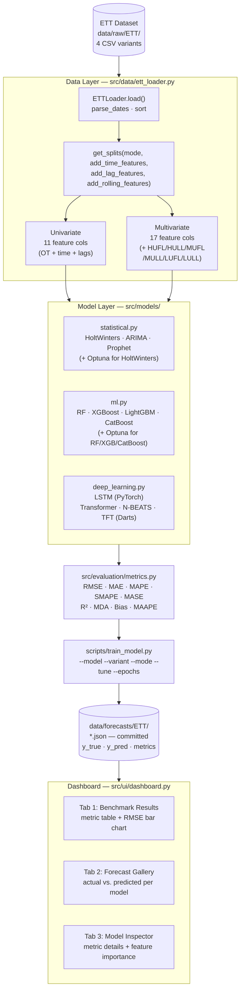

# Architecture — Time Series Forecasting Model Comparison

## System Overview



---

## Module Descriptions

### `src/data/ett_loader.py`

Core data module. `ETTVariant` enum (H1/H2/M1/M2) + `ETTLoader` class.

**Key methods:**

| Method | Description |
|--------|-------------|
| `load()` | Reads CSV, parses dates, sorts; cached on `self._df` |
| `get_splits(mode, add_time_features, add_lag_features, add_rolling_features)` | Returns `(train_df, val_df, test_df)` with 70/10/20 chronological split |
| `_add_time_features(df)` | Adds `hour_sin/cos`, `dow_sin/cos`, `month_sin/cos` (cyclical, ADR-002) |
| `_add_lag_features(df, lag_steps)` | Adds `OT_lag_N` columns (ML oracle inputs, ADR-005) |
| `_add_rolling_features(df)` | Adds `OT_rolling_mean_3`, `OT_rolling_std_3`, `OT_growth_rate`, `OT_trend_3` — all shifted by 1 to prevent leakage |

**Mode behaviour:**
- `univariate` — drops LOAD_COLS (`HUFL, HULL, MUFL, MULL, LUFL, LULL`) from returned DataFrames; model sees only OT history + time/lag features
- `multivariate` — keeps all 6 load columns; ML models use them as additional covariates alongside the OT target

---

### `src/models/statistical.py`

| Class | Backend | Interface |
|-------|---------|-----------|
| `HoltWintersModel` | statsmodels `ExponentialSmoothing` | `fit(y)`, `tune_with_optuna(y, n_trials=15)`, `predict(horizon)` |
| `ARIMAModel` | pmdarima `auto_arima` (test='adf') | `fit(y)`, `predict(horizon)` |
| `ProphetModel` | facebook prophet | `fit(y, dates_train)`, `predict(horizon)` |

Holt-Winters Optuna: 15 trials, minimize RMSE on train-fit residuals, searches trend/seasonal/damped_trend combinations.

---

### `src/models/ml.py`

All models: `fit(X, y)` / `predict(X)`. Boosting models additionally accept `X_val, y_val` for early stopping.

| Class | Backend | Optuna | Notes |
|-------|---------|--------|-------|
| `RandomForestModel` | sklearn | 10 trials, maximize R² | Default n_estimators=200 |
| `XGBoostModel` | xgboost | 50 trials, maximize R² | Default n_estimators=300 |
| `LightGBMModel` | lightgbm | Fixed params | Fixed regularized defaults: reg_alpha=0.1, reg_lambda=0.1, n_estimators=500 |
| `CatBoostModel` | catboost | 8 trials, maximize R² | Default iterations=300, l2_leaf_reg=3.0 |

After Optuna, best params are refit on `concat([X_train, X_val])` for maximum data usage.

---

### `src/models/deep_learning.py`

| Class | Backend | Device | Interface |
|-------|---------|--------|-----------|
| `LSTMModel` | PyTorch `_LSTMNet` | MPS/CUDA/CPU auto | `fit(y_train, y_val)`, `predict(y_context)` → horizon-step array |
| `TransformerModel` | Darts | (same as Darts backend) | `fit(y, dates, y_val, dates_val)`, `predict(horizon)` |
| `NBEATSModel` | Darts | | same |
| `TFTModel` | Darts | | same; `add_relative_index=True` |

Key implementation details:
- `_LSTMNet` defined at **module scope** (not inside `fit()`) — required for `joblib.dump`
- All Darts `TimeSeries` constructed from **float32** arrays — avoids MPS float64 error on Apple Silicon
- LSTM evaluated with **rolling-window oracle**: predict `horizon` steps, refresh context with ground-truth OT, advance by `horizon`

---

### `src/evaluation/metrics.py`

| Function | Formula | Range | Notes |
|----------|---------|-------|-------|
| `compute_rmse` | √mean((y−ŷ)²) | [0, ∞) | — |
| `compute_mae` | mean(\|y−ŷ\|) | [0, ∞) | — |
| `compute_mape` | mean(\|y−ŷ\|/\|y\|)×100 | [0, ∞) | Skips \|y\|<0.1 |
| `compute_smape` | mean(\|y−ŷ\|/((|y|+\|ŷ\|)/2))×100 | [0, 200] | Symmetric |
| `compute_mase` | MAE / mean\_abs\_diff(y_train) | [0, ∞) | <1 beats naive |
| `compute_r2` | 1 − SS_res/SS_tot | (−∞, 1] | 1=perfect |
| `compute_mda` | mean(sign(Δy)==sign(Δŷ))×100 | [0, 100] | — |
| `compute_bias` | mean(ŷ−y) | (−∞, ∞) | — |
| `compute_maape` | mean(arctan(\|y−ŷ\|/(|y|+ε)))×100 | [0, 45π/4] | — |

---

### `scripts/train_model.py`

Central training script. CLI arguments:

| Argument | Values | Effect |
|----------|--------|--------|
| `--model` | 11 model names | Which model to train |
| `--variant` | h1/h2/m1/m2 | Which ETT variant |
| `--mode` | univariate/multivariate | Feature matrix width |
| `--tune` | flag | Runs Optuna HPO before fit |
| `--epochs` | int (default 30) | DL model training epochs |
| `--horizon` | int (default 24) | Forecast horizon (steps) |

Run name: `{model}[_multivariate][_tuned]_{variant}` — encodes mode and HPO status in output filenames.

---

### `src/ui/dashboard.py`

Streamlit 3-tab dashboard. Reads `data/forecasts/ETT/*.json` only — no model weights, no ETT CSVs.

| Tab | Content |
|-----|---------|
| Benchmark Results | Sortable metric table, RMSE bar chart ranked by family |
| Forecast Gallery | Per-model actual vs. predicted plot (last N steps of test set) |
| Model Inspector | Side-by-side metric comparison, feature importance (RF/XGB/LGB/CB) |

---

## Data Flow: From CSV to Dashboard

```
data/raw/ETT/ETTh1.csv
    │
    ▼  ETTLoader.load()
pandas DataFrame (17,420 rows × 8 cols)
    │
    ▼  ETTLoader.get_splits(mode='univariate', add_lag_features=True)
train_df (12,177 rows × 11 cols)   ← after lag dropna
val_df   (1,742 rows × 11 cols)
test_df  (3,484 rows × 11 cols)
    │
    ▼  model.fit(X_train, y_train)
trained model (.joblib checkpoint → models/)
    │
    ▼  model.predict(X_test)
y_pred (3,484,) numpy array
    │
    ▼  compute_all_metrics(y_test, y_pred, y_train)
{"RMSE": 0.743, "MAE": 0.547, ...}
    │
    ▼  save_results()
data/forecasts/ETT/lightgbm_h1.json
    │
    ▼  streamlit run src/ui/dashboard.py
http://localhost:8501
```

---

## Hardware Compatibility

| Device | Statistical | ML | LSTM | Darts DL |
|--------|-------------|----|----|--------|
| CPU | ✓ | ✓ | ✓ (slow) | ✓ (slow) |
| Apple MPS | ✓ | ✓ | ✓ float32 | ✓ float32 required |
| NVIDIA CUDA | ✓ | ✓ | ✓ | ✓ |

MPS constraint: all PyTorch/Darts tensors must be `float32`. Code casts arrays before `TimeSeries.from_series()` and sets `dtype=torch.float32` in LSTM datasets.
